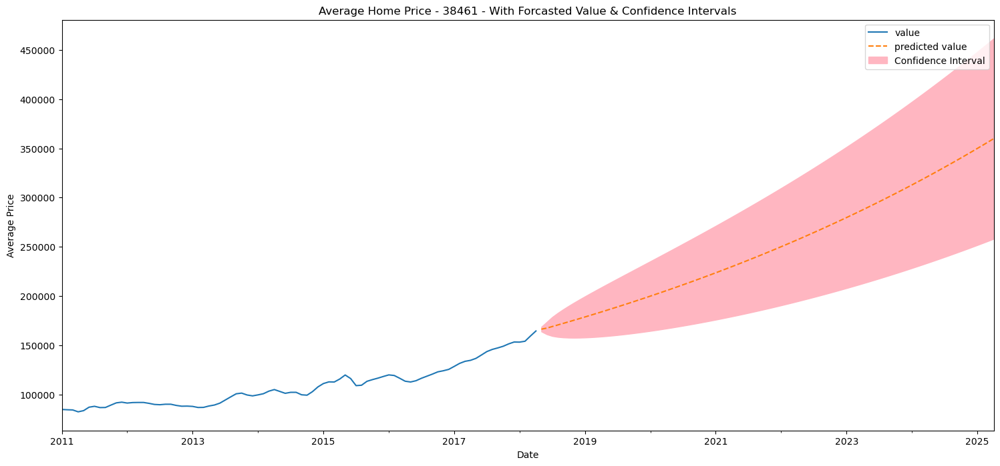
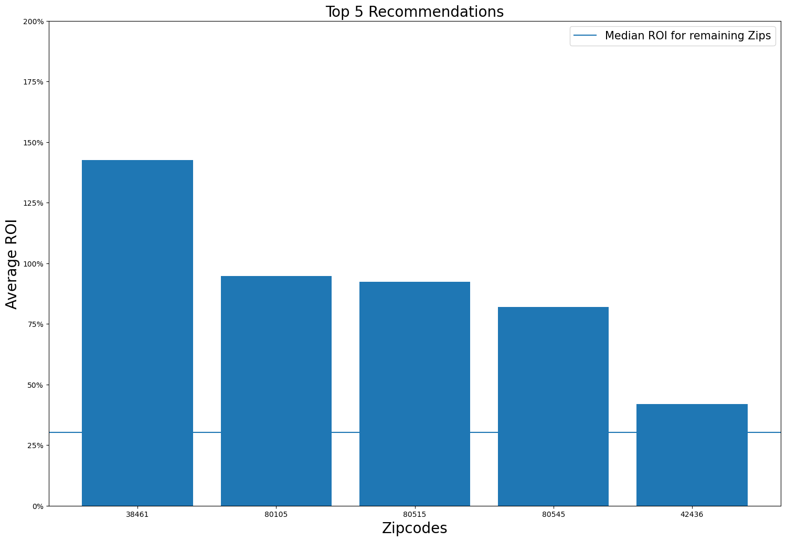

# Forecasting Optimal Real Estate Investments Using Time Series Modeling

## Top 5 Best US Zipcodes to Invest In 

### I. Overview

I've been engaged by a real estate investment company to assist them in the following areas

* How real estate prices have changed overtime and,
* How to use this information to invest in areas with the most potential value increase.
* To get me started I have been provided with a dataset from Zillow Research

 #### Home values
Zillow Home Value Index (ZHVI): A smoothed, seasonally adjusted measure of the typical home value and market changes across a given region and housing type. It reflects the typical value for homes in the 35th to 65th percentile range.

 #### Housing Bubble
On December 30, 2008, the Case–Shiller home price index reported its largest price drop in its history.
The credit crisis resulting from the bursting of the housing bubble is an important cause of the Great Recession in the United States.

### II. Business Problem

What are the top 5 best zip codes for us to invest in?

Defining "best":
* I used Coefficient of Variation (CV),Historical Price Appreciation:,SizeRank and Return On Investment ratio to measure 'best'.
* After some preliminary analysis of the data, I have decided to make 10 ZIP Codes computational runtime.

### III. Cleaning and Obtaining Data

* Total Zipcodes in DataFrame: 14723
* Number of selected ZIP codes: 10

### IV. EDA

* I used historical data to predict future ROI, starting with ZipCode-38461 as it has shown significant growth since 2011, and I will extend this approach to identify the top 5 zipcodes with the highest ROI predictions..

### V. Modeling

### VI. Forecasting

### VII. Recommendation

Invest in:

